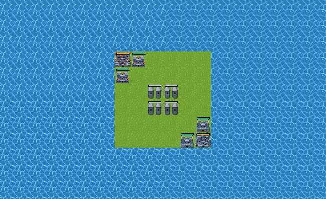
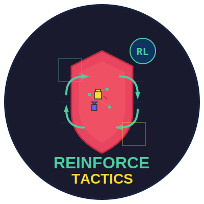

# Reinforce Tactics

[](https://github.com/kuds/reinforce-tactics/stargazers)
[](https://github.com/kuds/reinforce-tactics/blob/main/LICENSE)
[](https://github.com/kuds/reinforce-tactics/actions/workflows/python-package.yml)
[](https://github.com/kuds/reinforce-tactics/actions/workflows/pylint.yml)
[](https://github.com/kuds/reinforce-tactics/actions/workflows/deploy-docusaurus.yml)
[](https://reinforcetactics.com)


<!--  -->

A turn-based strategy game built with Pygame and Gymnasium for reinforcement learning research. Train RL agents, play against AI opponents (rule-based or LLM-powered), and experiment with tactical decision-making.

> **Requires Python 3.10+**

## Features

- **Tactical Gameplay**: 8 unit types (Warrior, Mage, Cleric, Archer, Knight, Rogue, Sorcerer, Barbarian) with unique abilities
- **Gymnasium Integration**: Standard RL environment with observation/action spaces and reward shaping
- **Multiple AI Opponents**: Rule-based bots (Easy/Medium/Hard) and LLM bots (GPT, Claude, Gemini)
- **Training Algorithms**: PPO/A2C/DQN via Stable-Baselines3, AlphaZero with MCTS, and Feudal RL (hierarchical manager-worker)
- **Action Masking**: MaskablePPO and legal-action masking across all bot types
- **Self-Play**: Train agents against copies of themselves with safe weight swapping
- **Tournament System**: Round-robin tournaments with ELO ratings, Docker support, and result tracking
- **Fog of War**: Line-of-sight visibility with terrain bonuses
- **Map Editor**: In-game editor for creating and modifying maps
- **Multi-Player Modes**: 1v1, 1v1v1 (free-for-all), and 2v2 (team) maps
- **Replay System**: Record games, replay them, and export to video
- **Sprite Animations**: Per-team palette swapping and movement path transitions
- **Save/Load**: Persist and resume in-progress games
- **Multi-Language**: English, Korean, Spanish, French, Chinese

<!--  -->

## Installation

```bash
# Clone the repository
git clone https://github.com/kuds/reinforce-tactics.git
cd reinforce-tactics

# Install base package (RL training, headless mode)
pip install -e .

# Install with GUI support
pip install -e ".[gui]"

# Install with LLM bot support
pip install -e ".[llm]"

# Install everything (GUI + LLM + dev tools)
pip install -e ".[all]"
```

<details>
<summary>What each extra includes</summary>

| Extra | Packages |
|-------|----------|
| *(base)* | gymnasium, pettingzoo, stable-baselines3, sb3-contrib, numpy, torch, tensorboard, pandas |
| `[gui]` | pygame-ce, opencv-python, matplotlib, Pillow |
| `[llm]` | openai, anthropic, google-genai |
| `[dev]` | pytest, pre-commit, pylint, flake8 |
| `[all]` | All of the above |

</details>

## Quick Start

### Play the Game

```bash
python main.py
```

### Train an RL Agent

```bash
# Train with PPO against bot
python main.py --mode train --algorithm ppo --timesteps 1000000 --opponent bot

# Train with self-play
python main.py --mode train --algorithm ppo --timesteps 1000000 --opponent self

# Train with reward shaping
python main.py --mode train --algorithm ppo --timesteps 500000 \
    --reward-income 0.1 --reward-units 0.05 --reward-structures 0.1

# Evaluate trained model
python main.py --mode evaluate --model models/ppo_model.zip --episodes 10

# View training stats
python main.py --mode stats
```

### Advanced Training

```bash
# AlphaZero with MCTS
python train/train_alphazero.py

# Feudal RL (hierarchical manager-worker)
python train/train_feudal_rl.py

# Self-play training
python train/train_self_play.py
```

### Use as Gymnasium Environment

```python
from reinforcetactics.rl.gym_env import StrategyGameEnv

env = StrategyGameEnv(
    map_file='maps/1v1/beginner.csv',
    opponent='bot',
    render_mode=None  # None for headless, 'human' for GUI
)

obs, info = env.reset()
action = env.action_space.sample()
obs, reward, terminated, truncated, info = env.step(action)
```

### Play Against LLM Bots

```python
from reinforcetactics.core.game_state import GameState
from reinforcetactics.game.llm_bot import OpenAIBot, ClaudeBot, GeminiBot
from reinforcetactics.utils.file_io import FileIO

map_data = FileIO.load_map('maps/1v1/test_map.csv')
game = GameState(map_data, num_players=2)

# Requires API key in environment (OPENAI_API_KEY, ANTHROPIC_API_KEY, or GOOGLE_API_KEY)
bot = ClaudeBot(game, player=2, model='claude-sonnet-4-5-20250929')
```

See the `examples/` directory for more, including an action-masking training demo.

## Game Rules

| Unit | Cost | Move | HP | Special |
|------|------|------|-----|---------|
| Warrior | 200 | 3 | 15 | High HP melee |
| Mage | 300 | 2 | 10 | Ranged 1-2, paralyze (3 turns, 2-turn cooldown) |
| Cleric | 200 | 2 | 8 | Heal/cure allies (range 1-2) |
| Archer | 250 | 3 | 15 | Ranged 2-3 tiles (+1 on mountains) |
| Knight | 350 | 4 | 18 | Charge (+50% dmg if moved 3+ tiles) |
| Rogue | 350 | 4 | 12 | Flank (+50% dmg), Evade (15% dodge, 30% in forest) |
| Sorcerer | 400 | 2 | 10 | Haste, Attack/Defence Buff (+35%) |
| Barbarian | 400 | 5 | 20 | Fast, high-damage melee |

**Win Conditions**: Capture enemy HQ or eliminate all enemy units

**Economy**: Starting gold $250. Income from structures each turn (HQ: $150, Building: $100, Tower: $50)

**Terrain**: Grass, forest (stealth bonus), mountains (vision/range bonus), roads (fast movement), water/ocean (impassable)

**Fog of War**: Enemy HQ is always visible; buildings and towers are hidden until scouted

## Project Structure

```
reinforce-tactics/
├── main.py                    # CLI entry point (train/evaluate/play/stats)
├── pyproject.toml             # Package config and dependencies
├── reinforcetactics/          # Main package
│   ├── core/                  # Game state, units, grid, visibility
│   ├── game/                  # Mechanics, bots (rule-based, LLM, model, AlphaZero)
│   ├── rl/                    # Gymnasium env, AlphaZero, Feudal RL, MCTS, self-play
│   ├── tournament/            # Tournament runner, ELO ratings, scheduling
│   ├── ui/                    # Pygame renderer, menus, map editor, sprites
│   └── utils/                 # File I/O, replay, settings, language, fonts
├── cli/                       # CLI command implementations
├── game/                      # Game loop, input handler, action executor
├── maps/                      # CSV map files (1v1, 1v1v1, 2v2)
├── train/                     # Training scripts (self-play, AlphaZero, Feudal RL)
├── eval/                      # Evaluation scripts
├── tests/                     # Test suite (24 files)
├── examples/                  # Example scripts and demos
├── notebooks/                 # Jupyter notebooks (PPO training, tournaments)
├── docker/                    # Docker configs for tournaments
├── assets/                    # Sprite sheets
├── docs-site/                 # Docusaurus documentation site
└── benchmarks/                # Performance benchmarks
```

## Testing

```bash
# Run all tests
pytest tests/

# Run a specific test file
pytest tests/test_mechanics.py -v
```

## Docker (Tournaments)

Run bot tournaments in a containerized environment:

```bash
cd docker/tournament
docker-compose up --build
```

Configure bots, maps, and settings in `docker/tournament/config.json`. See `docker/tournament/README.md` for details.

## Documentation

Full documentation available at [reinforcetactics.com](https://reinforcetactics.com), including:

- Detailed game rules and mechanics
- RL environment API reference
- LLM bot configuration and model options
- Tournament results and bot comparisons
- Map creation guide

Also see: [ROADMAP.md](ROADMAP.md) | [MAP_EDITOR.md](MAP_EDITOR.md)

## Contributing

Contributions welcome! Install dev dependencies and set up pre-commit hooks:

```bash
pip install -e ".[dev]"
pre-commit install
```

See the [documentation](https://reinforcetactics.com) for development guidelines.

## License

Apache License 2.0

## Citation

```bibtex
@software{reinforce_tactics,
  author = {Michael Kudlaty},
  title = {Reinforce Tactics: A Turn-Based Strategy Game for Reinforcement Learning},
  year = {2025},
  url = {https://github.com/kuds/reinforce-tactics}
}
```
