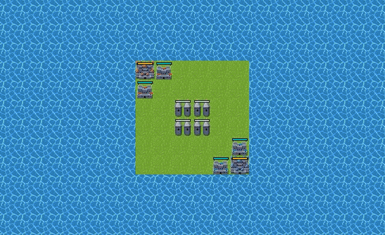
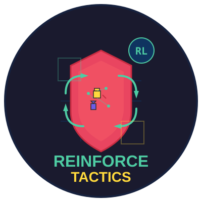

# Reinforce Tactics

[](https://github.com/kuds/reinforce-tactics/stargazers)
[](https://github.com/kuds/reinforce-tactics/blob/main/LICENSE)
[](https://github.com/kuds/reinforce-tactics/actions/workflows/python-package.yml)
[](https://github.com/kuds/reinforce-tactics/actions/workflows/lint.yml)
[](https://github.com/kuds/reinforce-tactics/actions/workflows/deploy-docusaurus.yml)
[](https://reinforcetactics.com)


<!--  -->

A turn-based strategy game built with Pygame and Gymnasium for reinforcement learning research. Train RL agents, play against AI opponents (rule-based or LLM-powered), and experiment with tactical decision-making.

> **Requires Python 3.11–3.13** (3.10 support was dropped in July 2026 ahead of its October 2026 EOL.)

## Features

- **Tactical Gameplay**: 8 unit types (Warrior, Mage, Cleric, Archer, Knight, Rogue, Sorcerer, Barbarian) with unique abilities
- **Gymnasium Integration**: Standard RL environment with observation/action spaces and reward shaping
- **Multiple AI Opponents**: Rule-based bots (Easy/Medium/Hard) and LLM bots (GPT, Claude, Gemini)
- **Training Algorithms**: PPO/A2C/DQN via Stable-Baselines3, AlphaZero with MCTS, and Feudal RL (hierarchical manager-worker)
- **Action Masking**: MaskablePPO and legal-action masking across all bot types
- **Self-Play**: Train agents against copies of themselves with safe weight swapping
- **Tournament System**: Round-robin tournaments with ELO ratings, Docker support, and result tracking
- **Fog of War**: Radius-based vision with terrain bonuses, remembered structures and ambushes
- **Map Editor**: In-game editor for creating and modifying maps
- **Multi-Player Modes**: 1v1, 1v1v1 (free-for-all), and 2v2 (team) maps
- **Replay System**: Record games, replay them, and export to video
- **Sprite Animations**: Per-team palette swapping and movement path transitions
- **Save/Load**: Persist and resume in-progress games
- **Multi-Language**: English, Korean, Spanish, French, Chinese

<!--  -->

## Installation

```bash
# Clone the repository
git clone https://github.com/kuds/reinforce-tactics.git
cd reinforce-tactics

# Install base package (RL training, headless mode)
pip install -e .

# Install with GUI support
pip install -e ".[gui]"

# Install with LLM bot support
pip install -e ".[llm]"

# Install everything (GUI + LLM + dev tools)
pip install -e ".[all]"
```

<details>
<summary>What each extra includes</summary>

| Extra | Packages |
|-------|----------|
| *(base)* | gymnasium, pettingzoo, stable-baselines3, sb3-contrib, numpy, torch, tensorboard, pandas |
| `[gui]` | pygame-ce, opencv-python, matplotlib, Pillow |
| `[llm]` | openai, anthropic, google-genai |
| `[dev]` | pytest, pytest-cov, pre-commit, ruff, mypy |
| `[all]` | All of the above |

</details>

## Quick Start

### Play the Game

```bash
python main.py
```

### Train an RL Agent

```bash
# Train with PPO against bot
python main.py --mode train --algorithm ppo --timesteps 1000000 --opponent bot

# Train with self-play (main.py trains against scripted bots only)
python scripts/train/train_self_play.py --config configs/self_play/self_play.yaml

# Train with reward shaping
python main.py --mode train --algorithm ppo --timesteps 500000 \
    --reward-income 0.1 --reward-units 0.05 --reward-structures 0.1

# Evaluate trained model
python main.py --mode evaluate --model models/ppo_model.zip --episodes 10

# View training stats
python main.py --mode stats
```

### Advanced Training

```bash
# AlphaZero with MCTS
python scripts/train/train_alphazero.py

# Feudal RL (hierarchical manager-worker)
python scripts/train/train_feudal_rl.py

# Self-play training
python scripts/train/train_self_play.py
```

### Use as Gymnasium Environment

```python
from reinforcetactics.rl.gym_env import StrategyGameEnv

env = StrategyGameEnv(
    map_file="maps/1v1/beginner.csv",
    opponent="bot",
    render_mode=None,  # None for headless, 'human' for GUI
)

obs, info = env.reset()
action = env.action_space.sample()
obs, reward, terminated, truncated, info = env.step(action)
```

### Play Against LLM Bots

```python
from reinforcetactics.core.game_state import GameState
from reinforcetactics.game.llm_bot import OpenAIBot, ClaudeBot, GeminiBot
from reinforcetactics.utils.file_io import FileIO

map_data = FileIO.load_map("maps/1v1/test_map.csv")
game = GameState(map_data, num_players=2)

# Requires API key in environment (OPENAI_API_KEY, ANTHROPIC_API_KEY, or GOOGLE_API_KEY)
bot = ClaudeBot(game, player=2, model="claude-sonnet-4-5-20250929")
```

See the `examples/` directory for more, including an action-masking training demo.

## Game Rules

| Unit | Cost | Move | HP | Special |
|------|------|------|-----|---------|
| Warrior | 200 | 3 | 15 | High HP melee |
| Mage | 300 | 2 | 10 | Ranged 1-2, paralyze (2 turns, 2-turn cooldown): the target loses its next 2 turns |
| Cleric | 200 | 3 | 10 | Heal (+7 HP) or cure allies (range 1-3) |
| Archer | 250 | 3 | 15 | Ranged 2-3 tiles (+1 on mountains) |
| Knight | 350 | 4 | 18 | Charge (+50% dmg if moved 3+ tiles) |
| Rogue | 350 | 4 | 12 | Flank (+50% dmg), Evade (15% dodge, 30% in forest) |
| Sorcerer | 350 | 2 | 12 | Haste, Attack/Defence Buff (+50%, 3 turns, 2-turn cooldown) |
| Barbarian | 400 | 5 | 20 | Fast, high-damage melee |

These numbers are the defaults in `reinforcetactics/rules.py` (`tests/test_rules_docs_core.py` fails if they drift apart); `engine_overrides` can change unit stats and the economy per game.

**Win Conditions**: With two sides (1v1, 2v2), capturing an enemy HQ wins the game for your side. A player who loses its last unit or resigns is eliminated, and a side whose players are all eliminated loses. With three or more sides (1v1v1 free-for-all), a player is also eliminated when its last HQ is captured; the game goes on until one side is left.

**Elimination**: An eliminated player's units are removed, its structures turn neutral (a neutral HQ is then an ordinary structure to capture) and its turns are skipped, so it gets no income or new units.

Games with three or more seats recorded before these rules (September 2026) were played by the old ones: any HQ capture won, and nobody was eliminated. Their replays still play back by those rules (the engine override `legacy_end_rules`, which replay playback sets for them).

**Teams**: A map declares teams on each player's HQ code as `h_<player>_<team>` (e.g. `h_3_1`), or code passes `GameState(teams={player: team})`; the two must agree. Without a declaration every player is its own side. Teammates never attack, paralyze or seize each other; they can heal, cure and buff each other's units (Haste targets only your own units), flank for each other and move through each other. The bundled 2v2 map plays players 1 and 3 against 2 and 4; the 2v2 mode gives those teams to a map that declares none.

**Turns**: Each turn starts with its player's income, auto-heal on owned structures, and status and cooldown ticks. Player 1's first turn skips this step, so it plays turn 0 on starting gold while Player 2 collects income before its first move. That long-standing schedule is the default; the engine override `begin_first_turn: true` gives Player 1 turn-0 income as well. Cancelling a move (in the GUI, before the unit acts) takes it back completely: it leaves no trace in the replay, and under fog of war what the move revealed is hidden again.

**Haste**: The target (one of your own units that is not paralyzed) gets one extra full action this turn. When it attacks, uses an ability or seizes (or Waits, in the GUI), it may move and act once more. A unit that has already acted is refreshed right away.

**Status durations** count the affected unit's own turns. A paralyzed unit loses its next 2 turns (`PARALYZE_DURATION`) and cannot counter-attack until its first free turn starts. A buff lasts 3 of the buffed unit's turns (`SORCERER_BUFF_DURATION`), counting the turn it is cast on your own unit.

**Economy**: Starting gold $250. Income from structures each turn (HQ: $150, Building: $100, Tower: $50)

**Movement**: Units move up to their Move value in orthogonal steps, through friendly units but not enemies, and must end on an empty tile. Every walkable tile costs 1 movement.

**Terrain**: Grass, roads and forests are open ground; forests give Rogues +15% evade; mountains give +1 vision and +1 Archer range; water/ocean are impassable

**Fog of War** (optional, off by default): each player sees a square around its own units (2-4 tiles; Archers and Rogues see farthest, +1 on a mountain) and structures (HQ 4, building 3, tower 5).
- Every HQ's location and starting owner are known from the start. Other buildings and towers are unknown until scouted; out of sight, a structure shows its owner and HP as you last saw them, so captures made out of sight stay hidden (unless `hq_always_visible` is set, below).
- Enemies you can't see never block your move options. A move whose path runs into a hidden enemy is *ambushed*: the unit stops on the last free tile before it, the move is spent (it can't be cancelled), and the enemy is revealed. The unit takes a shortest route by what you can see (the same route every time).
- A unit can only attack enemies that were in sight when its action began, so it can't attack an enemy it found by moving (or by being ambushed).
- Saves keep each player's explored map and memory.

**Optional rules** (`engine_overrides`, all off by default, so the default game is exactly as described above):

| Key | Default | Effect when set |
|-----|---------|-----------------|
| `terrain_move_cost` | every tile costs 1 | Movement cost per tile type, e.g. `{"r": 0.5, "f": 2, "m": 2}` for fast roads and slow forests/mountains |
| `charge_distance` | `"displacement"` | `"path"`: Knight Charge counts the tiles walked, not the straight-line distance |
| `forest_concealment` | `false` | Under fog of war, a unit in forest is seen only by enemies on or next to its tile |
| `hq_always_visible` | `false` | Under fog of war, every HQ's current owner is always known (by default an HQ out of sight shows its owner as last seen) |

## Project Structure

```
reinforce-tactics/
├── main.py                    # CLI entry point (train/evaluate/play/stats)
├── pyproject.toml             # Package config and dependencies
├── reinforcetactics/          # Main package
│   ├── app/                   # Game loop, input handler, action executor, bot factory
│   ├── cli/                   # CLI command implementations (train/evaluate/play/stats)
│   ├── core/                  # Game state, units, grid, visibility
│   ├── game/                  # Mechanics, bots (rule-based, LLM, model, AlphaZero)
│   ├── rl/                    # Gymnasium env, AlphaZero, Feudal RL, MCTS, self-play
│   ├── tournament/            # Tournament runner, ELO ratings, scheduling
│   ├── ui/                    # Pygame renderer, menus, map editor, sprites and colours (assets.py)
│   ├── utils/                 # File I/O, replay, settings, language, fonts, deps
│   ├── rules.py               # Unit stats, economy, combat and status-effect rules
│   └── constants.py           # Old import path: re-exports rules.py and ui/assets.py
├── scripts/                   # Standalone scripts (training, eval, tournaments, asset gen)
│   └── train/                 # Training entry points (self-play, AlphaZero, Feudal RL)
├── maps/                      # CSV map files (1v1, 1v1v1, 2v2)
├── configs/                   # YAML configs for training scripts
├── tests/                     # Test suite
├── examples/                  # Example scripts and demos
├── notebooks/                 # Jupyter notebooks (PPO training, tournaments)
├── docker/                    # Docker configs for tournaments
├── assets/                    # Sprite sheets
├── images/                    # README images and demo media
├── docs-site/                 # Docusaurus documentation site
└── benchmarks/                # Performance benchmarks
```

## Testing

```bash
# Run all tests
pytest tests/

# Run a specific test file
pytest tests/test_mechanics.py -v
```

## Docker (Tournaments)

Run bot tournaments in a containerized environment:

```bash
cd docker/tournament
docker-compose up --build
```

Configure bots, maps, and settings in `docker/tournament/config.json`. See `docker/tournament/README.md` for details.

## Cloud Training (Vertex AI)

Run a single long-running training job on Google Cloud using the project's
Docker image and Vertex AI custom jobs. Trained models, checkpoints, and logs are
synced to Google Cloud Storage automatically (the job's machine is ephemeral).

```bash
# Build + push the training image to Artifact Registry (via Cloud Build)
PROJECT_ID=your-project REGION=us-central1 ./scripts/cloud/build_image.sh

# Submit a job — anything after the script is the training command
BUCKET=your-bucket ./scripts/cloud/submit_vertex_job.sh \
  python3 main.py --mode train --algorithm ppo --timesteps 10000000

# ...or run the full curriculum bootstrap headlessly (charts + replay videos),
# a CLI mirror of notebooks/ppo_bootstrap.ipynb:
BUCKET=your-bucket ./scripts/cloud/submit_vertex_job.sh \
  python3 scripts/train/train_bootstrap.py --config configs/ppo/bootstrap.yaml --device cuda

# Fetch the trained model when it's done
gcloud storage cp -r gs://your-bucket/jobs/JOB_NAME/models ./models
```

See [`docs/vertex_training.md`](docs/vertex_training.md) for prerequisites, GPU
selection, IAM, and troubleshooting.

## Documentation

Docs are split by audience:

- **Users** — [reinforcetactics.com](https://reinforcetactics.com) (sourced from
  [`docs-site/`](docs-site/)): game rules, RL environment API, LLM bot
  configuration, tournament results, map creation guide.
- **Contributors** — [`docs/`](docs/) (see [`docs/README.md`](docs/README.md) for
  an index): roadmap, internal code reviews, and developer-facing guides.

## Contributing

Contributions welcome! Install dev dependencies and set up pre-commit hooks:

```bash
pip install -e ".[dev]"
pre-commit install
```

CI runs these four checks; run them before pushing to get the same answer
locally that the build will give you:

```bash
ruff check .          # lint
ruff format --check . # formatting
mypy .                # types — the whole tree, not just reinforcetactics/
pytest                # tests, with the coverage gate from pyproject.toml
```

`pre-commit install` wires up all four except `pytest`.

## License

Apache License 2.0

## Citation

```bibtex
@software{reinforce_tactics,
  author = {Michael Kudlaty},
  title = {Reinforce Tactics: A Turn-Based Strategy Game for Reinforcement Learning},
  year = {2025},
  url = {https://github.com/kuds/reinforce-tactics}
}
```
