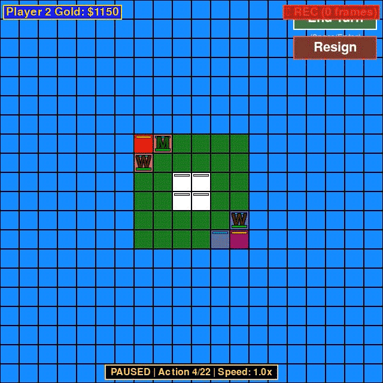

# Reinforce Tactics

[](https://github.com/kuds/reinforce-tactics/stargazers)
[](https://github.com/kuds/reinforce-tactics/blob/main/LICENSE)
[](https://github.com/kuds/reinforce-tactics/actions/workflows/deploy-docusaurus.yml)
[](https://reinforcetactics.com)


A turn-based strategy game built with Pygame and Gymnasium for reinforcement learning research. Train RL agents, play against AI opponents (rule-based or LLM-powered), and experiment with tactical decision-making.

## Features

- **Tactical Gameplay**: 8 unit types (Warrior, Mage, Cleric, Archer, Knight, Rogue, Sorcerer, Barbarian) with unique abilities
- **Gymnasium Integration**: Standard RL environment with observation/action spaces and reward shaping
- **Multiple AI Opponents**: Rule-based bots (Easy/Medium/Hard) and LLM bots (GPT, Claude, Gemini)
- **Training Support**: Headless mode, self-play, action masking (MaskablePPO), and Stable-Baselines3 integration
- **Replay System**: Record games and export to video
- **Multi-language**: English, Korean, Spanish, French, Chinese



## Installation

```bash
# Basic (GUI only)
pip install pygame pandas numpy

# With RL training
pip install pygame pandas numpy gymnasium stable-baselines3[extra]

# Optional: video export
pip install opencv-python
```

## Quick Start

### Play the Game

```bash
python main.py
```

### Train an RL Agent

```bash
# Train with PPO against bot
python main.py --mode train --algorithm ppo --timesteps 1000000 --opponent bot

# Train with self-play
python main.py --mode train --algorithm ppo --timesteps 1000000 --opponent self

# Evaluate trained model
python main.py --mode evaluate --model models/ppo_model.zip --episodes 10
```

### Use as Gymnasium Environment

```python
from reinforcetactics.rl.gym_env import StrategyGameEnv

env = StrategyGameEnv(
    map_file='maps/1v1/test_map.csv',
    opponent='bot',
    render_mode=None  # None for headless, 'human' for GUI
)

obs, info = env.reset()
action = env.action_space.sample()
obs, reward, terminated, truncated, info = env.step(action)
```

### Play Against LLM Bots

```python
from reinforcetactics.core.game_state import GameState
from reinforcetactics.game.llm_bot import OpenAIBot, ClaudeBot, GeminiBot
from reinforcetactics.utils.file_io import FileIO

map_data = FileIO.load_map('maps/1v1/test_map.csv')
game = GameState(map_data, num_players=2)

# Requires API key in environment (OPENAI_API_KEY, ANTHROPIC_API_KEY, or GOOGLE_API_KEY)
bot = ClaudeBot(game, player=2, model='claude-3-5-haiku-20241022')
```

## Game Rules

| Unit | Cost | Move | HP | Special |
|------|------|------|-----|---------|
| Warrior | 200 | 3 | 15 | High HP melee |
| Mage | 250 | 2 | 10 | Ranged, paralyze (3 turns) |
| Cleric | 200 | 2 | 8 | Heal allies, cure paralysis |
| Archer | 250 | 3 | 15 | Ranged 2-3 tiles (+1 on mountains) |
| Knight | 350 | 4 | 18 | Charge (+50% dmg if moved 3+ tiles) |
| Rogue | 300 | 4 | 12 | Flank (+50% dmg), Evade (25% dodge) |
| Sorcerer | 300 | 2 | 10 | Haste (grant ally extra action) |
| Barbarian | 400 | 5 | 20 | Fast, high-damage melee |

**Win Conditions**: Capture enemy HQ or eliminate all enemy units

**Economy**: Starting gold $250. Income from structures each turn (HQ: $150, Building: $100, Tower: $50)

## Project Structure

```
reinforce-tactics/
├── main.py                    # CLI entry point
├── reinforcetactics/          # Main package
│   ├── core/                  # Game state, units, grid
│   ├── game/                  # Mechanics, bots, LLM integration
│   ├── rl/                    # Gymnasium environment
│   ├── ui/                    # Pygame renderer, menus
│   └── utils/                 # File I/O, replay, settings
├── maps/                      # CSV map files
├── train/                     # Training scripts
├── tests/                     # Test suite
└── docs-site/                 # Documentation site
```

## Documentation

Full documentation available at [reinforcetactics.com](https://reinforcetactics.com), including:

- Detailed game rules and mechanics
- RL environment API reference
- LLM bot configuration and model options
- Tournament results and bot comparisons
- Map creation guide

## Contributing

Contributions welcome! See the [documentation](https://reinforcetactics.com) for development guidelines.

## License

Apache License 2.0

## Citation

```bibtex
@software{reinforce_tactics,
  author = {Michael Kudlaty},
  title = {Reinforce Tactics: A Turn-Based Strategy Game for Reinforcement Learning},
  year = {2025},
  url = {https://github.com/kuds/reinforce-tactics}
}
```
