# Visual Style Review: Toward a Classic Handheld Tactics Look

**Date:** 2026-09-27
**Scope:** The Pygame client: renderer, unit sprites and animations, tiles, colour schemes, HUD, in-game menus and front-end menus. Measured against the pixel-art presentation of classic handheld grid-tactics games (240×160 screen, 16 px tiles), referred to below as "the reference games".
**Method:** Code reading plus headless screenshots of the real screens (`SDL_VIDEODRIVER=dummy`, `Renderer(game)` and `Renderer(game, pixel_art=True)` on `maps/1v1/crossroads.csv` and `maps/1v1/mountain_snipers.csv`), and scripted measurements of the sprite sheets.

---

## Executive Summary

The art itself is the right kind. The eight unit sheets and the tiles are a cohesive 32 px pixel-art set with 4-frame idles and 8-frame walk cycles in four directions. That is close to what the reference games use for map sprites.

What holds the game back is how that art reaches the screen:

1. **A fresh install shows no pixel art.** Sprite paths default to empty, so the game draws coloured squares and letters.
2. **Units never walk.** The walk-cycle system is built but nothing calls it. Units teleport, and enemy turns resolve instantly.
3. **The sprite crop cuts off every unit's feet and shadow**, and on some units the weapon or hat.
4. **Team colour barely reaches the sprites** (0% on the Rogue), so the renderer draws a coloured square around every unit.
5. **The interface is styled like a desktop app.** Anti-aliased Noto Sans, flat rounded rectangles and a HUD drawn on top of the map sit on 1× pixel art. The reference games use a fixed low-res screen, one pixel font, framed windows and a tile cursor.

| Severity | Count | Summary |
|----------|-------|---------|
| Critical | 2 | Pixel art off by default; walk animations never played |
| Major | 12 | Sprite crop, team colour, scale/camera, HUD over the map, combat feedback, autotiling, action and shop menus, fonts, ligature bug, window skin, palette |
| Minor | 8 | Status badges, greyed-out units, animation timers, audio/phase banners, overlays, info panels, HUD contrast, title/setup screens |

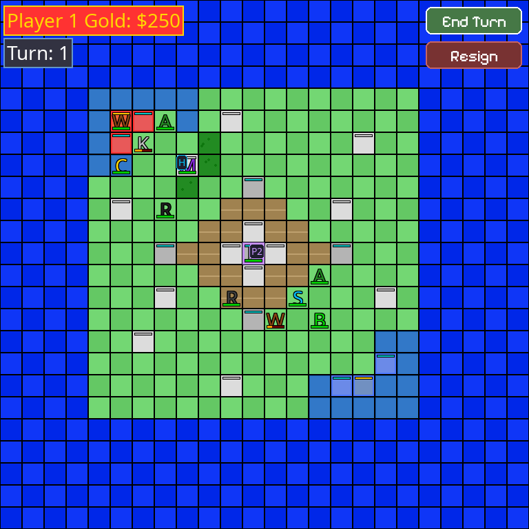
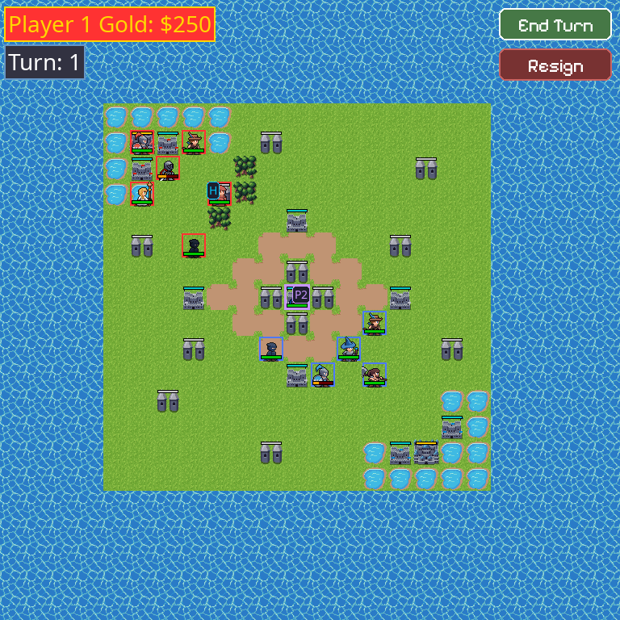

*First image: what `python main.py` draws on a fresh install. Second image: the same position with the bundled art forced on (`pixel_art=True`, which video export already uses).*

---

## 1. Rendering pipeline and scale

### 1.1 [Critical] The bundled pixel art is off by default

**Files:** `reinforcetactics/utils/settings.py:23,26`, `reinforcetactics/app/game_loop.py:467,584`, `reinforcetactics/ui/renderer.py:90,204`

`DEFAULT_SETTINGS["graphics"]` has `sprites_path: ""` and `use_tile_sprites: False`. The game creates `Renderer(game)` with `pixel_art=None`, which defers to those settings, so nothing loads and every unit is a letter on a flat tile. The bundled `assets/sprites/` directory is only used when `pixel_art=True` (video export). A new player has to find Settings → Graphics and type a path to see the art.

**Fix:** When `sprites_path` is empty, fall back to `_resolve_bundled_sprites_path()` and treat tile sprites as on. Keep the letter mode as an explicit option.

### 1.2 [Major] 1× native scale, window sized to the map, no camera

**Files:** `reinforcetactics/ui/renderer.py:97-120`, `reinforcetactics/ui/assets.py:24`

The window is `grid × 32` px and the art is drawn at 1×, so on a modern monitor the units are small and detailed rather than chunky. A 25×25 map opens a 928 px tall window with no scrolling. The reference games use a fixed 240×160 screen (15×10 tiles of 16 px) with a camera that follows the cursor, scaled up by a whole number.

**Fix:** Draw the world and the UI onto one fixed low-res canvas (for example 480×320 = 15×10 tiles of 32 px, or 640×360), scale it to the window by an integer factor with nearest-neighbour (`pygame.SCALED` does this), and add a camera that follows the cursor or selected unit.

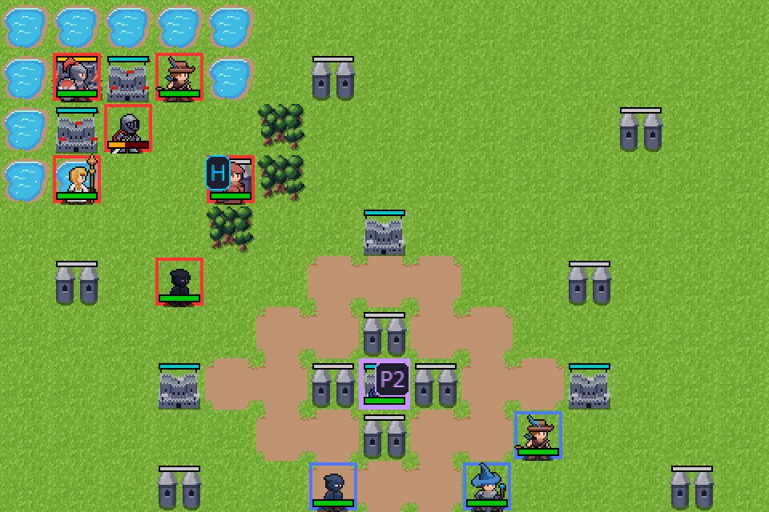

*The same art through a 15×10-tile window at 2×. At this scale the square borders, HP bars and status badges also become the dominant shapes (see 2.3).*

### 1.3 [Major] The HUD sits on top of playable tiles

**Files:** `reinforcetactics/ui/renderer.py:369-370,772-831`, `reinforcetactics/app/input_handler.py:184-214`

End Turn and Resign are at fixed pixel positions over the board. On 20×20 maps (most of `maps/1v1/`) the Resign button covers playable tiles in row 2. The button check runs before the grid click, so clicking a unit under it opens the resign dialog. In the screenshot a Player 1 Archer stands on the tile under Resign and cannot be seen.

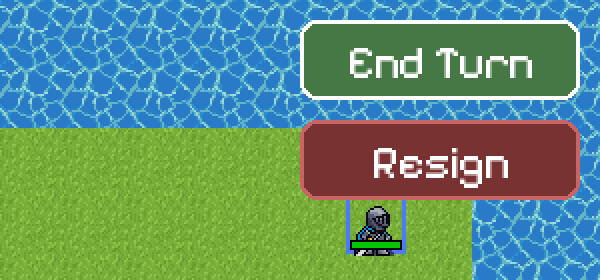

**Fix:** Move End Turn and Resign into a map menu. In the reference games that menu opens when you select an empty tile, with End at the bottom. Info panels go in screen corners and move to the opposite side when the cursor gets close.

---

## 2. Units and team colour

### 2.1 [Major] The centre crop cuts off feet, shadows and weapons

**Files:** `reinforcetactics/ui/assets.py:162-168`, `reinforcetactics/ui/sprite_animator.py:180-183`

Each 64×64 frame is centre-cropped to `Rect(16, 16, 32, 32)`. Every unit's feet and drop shadow end at y = 51 of the frame, so 28 of 28 frames lose pixels on every unit. The Barbarian also loses the axe head on the left, and the Sorcerer's hat tip and the Cleric's staff are clipped at the top.

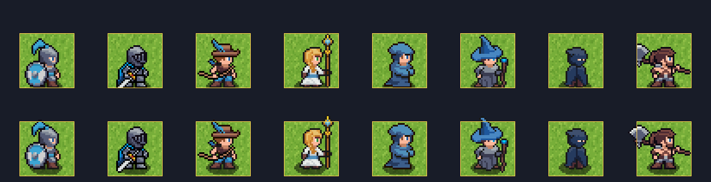

*Top: current crop. Bottom: `Rect(8, 4, 48, 48)` drawn bottom-centred on the tile (yellow outline) and allowed to overflow upward.*

**Fix:** Crop `Rect(8, 4, 48, 48)`, blit it so the frame's feet line sits on the tile's bottom edge, let it overflow the tile upward and sideways (the standard way to draw tall units), and draw units sorted by `y` so overlaps stack correctly.

### 2.2 [Major] Team colour barely reaches most sprites

**Files:** `reinforcetactics/ui/assets.py:52-107`, `reinforcetactics/ui/renderer.py:684-687`

The palette swap replaces the nine blues in `BASE_SPRITE_COLORS`. Measured on the idle frame:

| Unit | Opaque px | Recoloured | Blue px left unswapped |
|------|----------:|-----------:|------------------------|
| Mage | 403 | 45.2% | 43 (`#253a5e`) |
| Warrior | 478 | 17.6% | 0 (the other 86 are grey steel) |
| Sorcerer | 498 | 7.8% | 139 (`#4887c2`, `#1e4677`, `#0ce6f2`), so the hat stays blue on every team |
| Cleric | 441 | 4.8% | 0 |
| Knight | 401 | 4.2% | 70 (`#123258` and steel) |
| Archer | 439 | 4.1% | 24 (`#2873b0`) |
| Barbarian | 511 | 0.4% | 0 |
| Rogue | 334 | **0.0%** | 170 (`#253a5e`, `#3f506e`, `#172038`), so all four teams are identical navy |

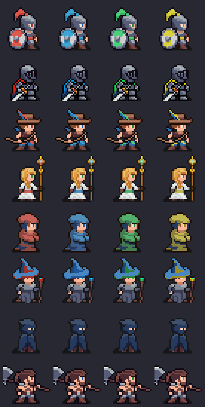

To compensate, the renderer draws a 2 px square in the player colour around every unit. The reference games have no boxes: team colour is the unit's main hue, recolouring the whole unit or at least its armour and clothing.

**Fix:** Give each sheet a dedicated team ramp of 3-5 colours that appear nowhere else on the sprite, repaint the team regions (Rogue cloak, Barbarian cloth, Knight tabard, Archer and Cleric clothing, Sorcerer hat), and map each team to its own ramp. As a stopgap, add the unswapped blues above with matching ramps. Then remove the square border.

### 2.3 [Minor] Status overlays cover the sprite

**Files:** `reinforcetactics/ui/renderer.py:614-658,738-761,533-556`

The paralysis badge ("P2") covers most of the Knight, the haste badge ("H") covers the Mage's face, every unit carries a 5 px HP bar even at full health, and every structure carries an HP bar. The reference games show a small HP digit only on damaged units, or show HP in the unit window.

**Fix:** Hide bars at full HP, use a 2 px bar or a small HP digit, show statuses as small 8×8 icons in a corner, and show structure bars only while damaged or being captured.

### 2.4 [Minor] Units that have acted are darkened, not greyed

**File:** `reinforcetactics/ui/renderer.py:664-679`

`BLEND_MULT` with (128, 128, 128) halves brightness but keeps the hue, so a finished red unit is dark red. The reference games switch finished units to a grey palette, which reads instantly.

**Fix:** Generate a desaturated copy of each sheet at load time, the same way team variants are made.

---

## 3. Animation and game feel

### 3.1 [Critical] Walk cycles are never played; units teleport

**Files:** `reinforcetactics/ui/sprite_animator.py:377-425`, `reinforcetactics/ui/renderer.py:1022-1069`, `reinforcetactics/app/input_handler.py:406`, `docs/ROADMAP.md:57`

`queue_movement_path`, `update_unit_state_from_movement`, `set_unit_idle` and `cleanup_unit_animation` have no callers outside their own definitions. `move_unit` moves the unit instantly and the action menu opens the same frame. Bot turns also resolve instantly, one per frame. The roadmap lists "movement path transitions" as complete.

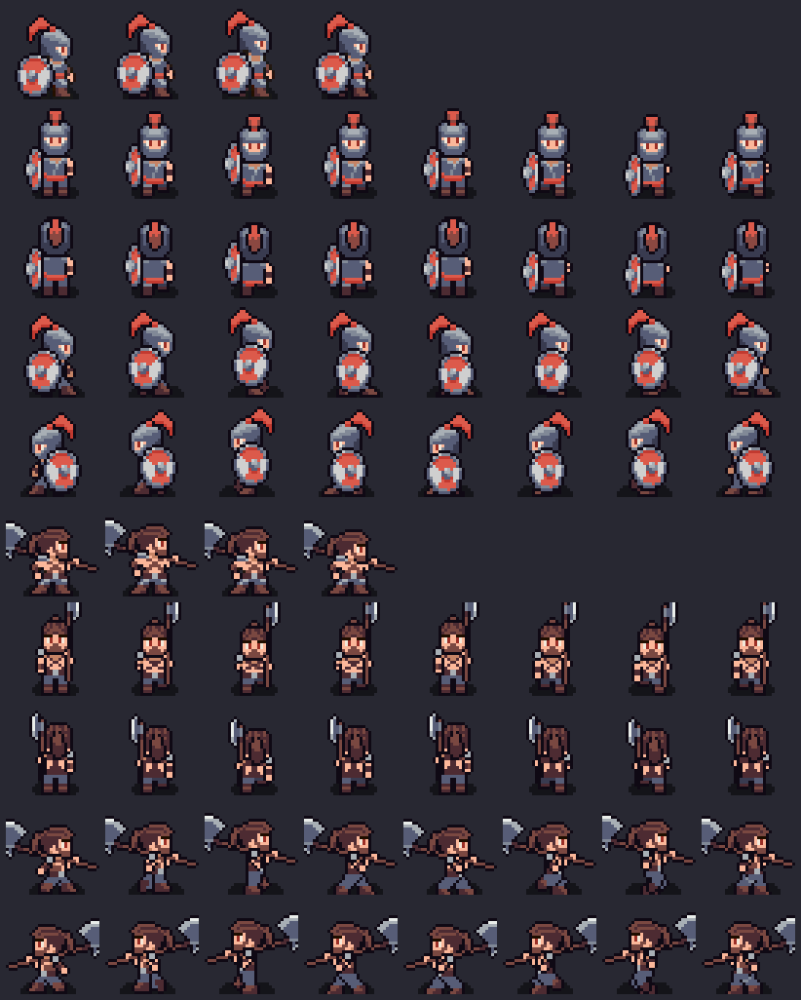

**Fix:** After a legal move, take the path from the pathfinder, move the sprite tile by tile (about 0.08-0.12 s per tile) while playing the matching direction, block input until it arrives, then open the action menu. Play bot moves the same way so the enemy phase can be watched.

### 3.2 [Major] No combat feedback on screen

**Files:** `reinforcetactics/app/action_executor.py:23-35`, `reinforcetactics/core/unit.py:96`, `reinforcetactics/core/mechanics.py:363`

Attack results are printed to the console; on screen only the HP bar changes. The genre's map-combat language: the attacker lunges half a tile toward the target, a white hit flash, a 2-3 px shake, a damage number, the HP bar draining over about 0.4 s, and a defeated unit blinking out. Before confirming, a forecast window shows both sides' damage (HP, damage, hit chance, or a damage percentage).

The sheets contain only idle and walk frames (rows 0-4). Attack and hurt poses would need new art, but lunge, flash and shake need none. A forecast can be built on `Unit.get_attack_damage` and `_calculate_counter_damage`.

### 3.3 [Minor] Per-unit animation timers, never cleaned up

**File:** `reinforcetactics/ui/sprite_animator.py:255-327,435-440`

Timers are keyed by `id(unit)` and `cleanup_unit` is never called, so a new unit can inherit a removed unit's state when Python reuses the id. Units created mid-game also idle out of step; in the reference games idle bobs are in sync across the map.

**Fix:** Drive the idle frame from one global clock, and key per-unit state by `unit_id`.

### 3.4 [Minor] No phase banners and no audio

There is no "Player 1 Phase" or "Day 3" style banner at turn change, and no sound at all (`pygame.mixer` is not used). A cursor tick, select, confirm, cancel and hit sound carry much of the genre's feel.

---

## 4. Map and terrain

### 4.1 [Major] No autotiling: water and roads are drawn tile by tile

**Files:** `reinforcetactics/ui/renderer.py:449-463`, `assets/sprites/tiles/`

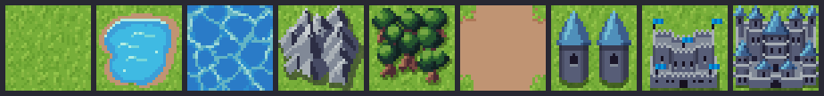

`water.png` is a self-contained pond with a sand rim, so a lake becomes a grid of separate puddles. `road.png` is a rounded dirt patch, so roads read as blobs. The ocean border is a high-contrast pattern that competes with the units. The reference games choose edge and corner pieces from each tile's neighbours.

**Fix:** Add 4-bit (16 piece) or 47-piece autotiling for water, road and shoreline, keeping the existing random-variant system for grass and forest (`grass_2.png` and others are sitting in `tiles/unused/`). Calm the ocean and animate 2-3 frames slowly.

### 4.2 [Minor] Movement and attack overlays

**Files:** `reinforcetactics/ui/theme.py:112-124`, `reinforcetactics/ui/renderer.py:861-907`

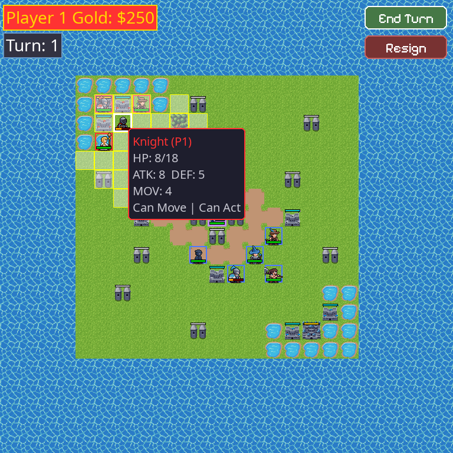

Reachable tiles are a white wash with a 1 px yellow outline. Attack range appears only while the right mouse button is held. The genre convention is blue move tiles with a red attack fringe as soon as a unit is selected, plus a path arrow from the unit to the cursor.

**Fix:** Blue move tiles and a red attack fringe on selection, a path arrow, and a slow shimmer on the range.

---

## 5. HUD and in-game menus

### 5.1 [Major] Unit action menu

**File:** `reinforcetactics/ui/menus/in_game/unit_action_menu.py:77-107,193-241`

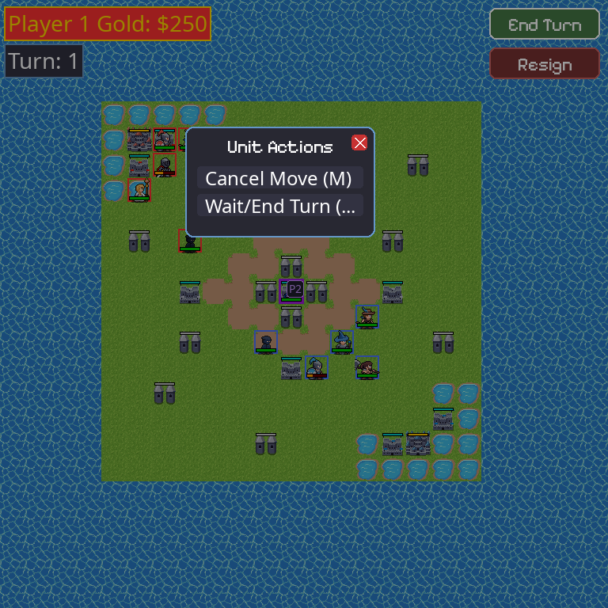

The menu dims the whole map, is 240 px wide with a "Unit Actions" title, puts hotkeys inside the labels, and truncates "Wait/End Turn (…". It has no arrow-key navigation: only letter hotkeys and the mouse. The reference games show a small window beside the unit with short verbs (Attack, Wait), a hand cursor, arrows plus confirm and cancel, and no dimming.

**Fix:** Size the window to its labels, drop the title and the dimming, add Up/Down and Enter/Space, make Esc and right-click go back.

### 5.2 [Major] Purchase menu truncates names and shows no units

**File:** `reinforcetactics/ui/menus/in_game/unit_purchase_menu.py:214,239`

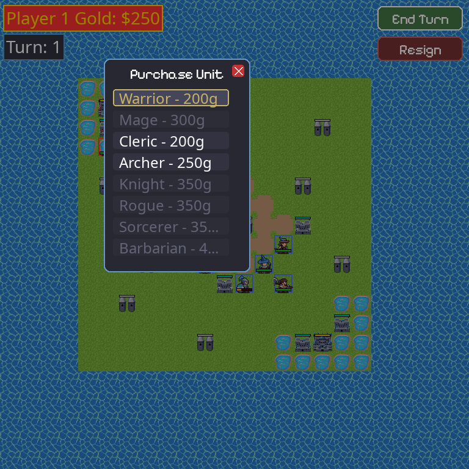

The buttons are 190 px wide, so "Sorcerer - 35…" and "Barbarian - 4…" are cut off. There is no unit art, and the window covers the building it was opened from. A genre-standard build menu lists a sprite icon, name and right-aligned cost, greys out what you cannot afford, and shows stats for the highlighted unit.

**Fix:** Icon, name and cost columns sized to content; a stats panel; the team-coloured idle sprite for each row.

### 5.3 [Minor] Hover tooltip instead of unit and terrain windows

**File:** `reinforcetactics/ui/renderer.py:909-1014`

The tooltip follows the mouse. The reference games keep a unit window in a corner (sprite or portrait, name, HP bar) and a terrain window (name, defence stars or DEF/AVO). This game has terrain effects (mountain range bonus, forest evade for Rogues, move costs) that are not shown anywhere.

### 5.4 [Minor] HUD contrast

**File:** `reinforcetactics/ui/renderer.py:779-790` (label text built at line 783)

The gold label is yellow `(255, 215, 0)` text on the player colour. Contrast is 2.6:1 on red, 2.7:1 on blue, **1.3:1 on yellow and 1.03:1 on green**, so in 3-4 player games the gold readout is close to invisible for players 3 and 4. It also says "$250" while the shop says "200g".

---

## 6. Menus and typography

### 6.1 [Major] Two type systems, one of them not pixel

**Files:** `reinforcetactics/utils/fonts.py`, `reinforcetactics/ui/theme.py:171-180`

60 calls use `get_font` (Noto Sans, smooth vector type at 14-32 px) and 7 use `get_display_font` (Pixelify Sans). Smooth type beside pixel art is the strongest "not a GBA game" signal on every screen.

**Fix:** One pixel font for all UI, rendered with `antialias=False` at its native size or whole multiples, keeping the CJK fallback.

### 6.2 [Major] Pixelify Sans ligatures turn "fi" into "A"

**Files:** `assets/fonts/PixelifySans-Regular.ttf`, `reinforcetactics/utils/language.py:56`

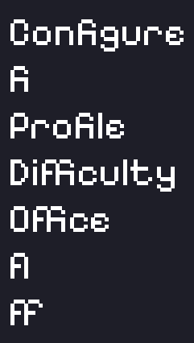

SDL_ttf applies the font's `fi`, `fl` and `ff` ligatures, which read as "A" and "F" at this size: the player setup screen is titled "ConAgure Players". A zero-width non-joiner did not prevent it in pygame-ce 2.5.8. Any display-font string with those pairs is affected (French "Configurer" too).

**Fix:** Use a ligature-free pixel font, or render affected strings glyph by glyph.

### 6.3 [Major] Menu chrome is flat rounded rectangles

**Files:** `reinforcetactics/ui/theme.py:9-31,134-137`, `reinforcetactics/ui/menus/base.py`, `reinforcetactics/ui/widgets/button.py`

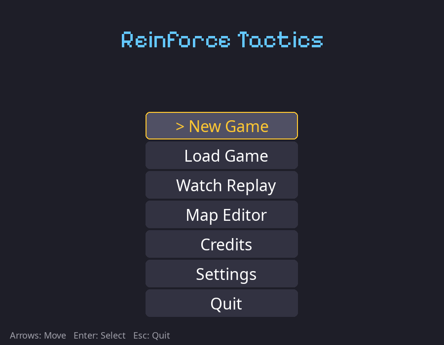
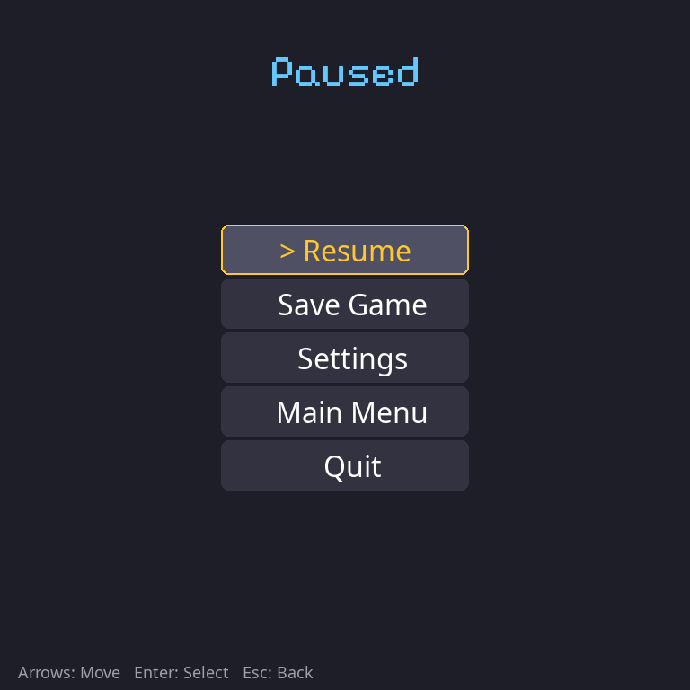

Menus are dark rounded rectangles (36 `border_radius` uses) with a "> " prefix for the selection. The pause menu replaces the board with a blank screen. The reference games use framed windows (blue gradient panels with bevelled light borders, or bright panels with heavy outlines) and a pointing-hand cursor.

**Fix:** One 9-slice window skin (8×8 corners) drawn at integer scale and used by every menu and dialog, an animated hand or arrow cursor sprite, and the pause menu as a small window over the dimmed but visible map.

### 6.4 [Minor] Title and setup screens

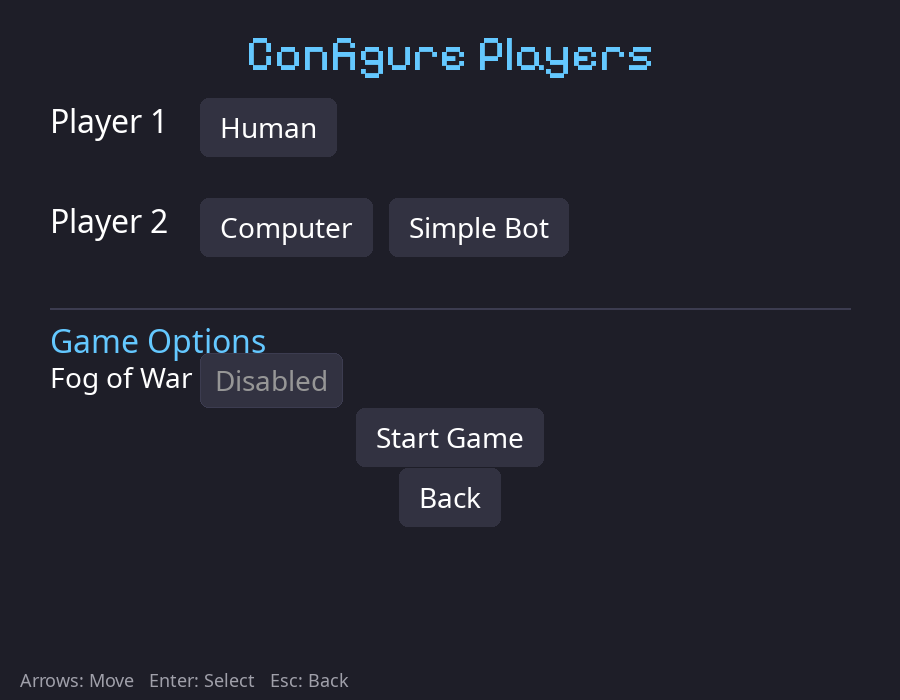

The title screen is text only, with seven equal buttons; `images/reinforce_tactics_logo.svg` exists but is unused. Player setup is generic toggle buttons. The reference games open on an illustrated title and "Press Start", and army selection shows the army colour and units.

**Fix:** A live map scene with idling units behind the logo and a short menu; player cards in each team's colour with a sample unit.

---

## 7. Colour scheme

### 7.1 [Major] Three unrelated palettes

**Files:** `reinforcetactics/ui/assets.py:42-47,67-107`, `reinforcetactics/ui/theme.py`

`PLAYER_COLORS` are saturated primaries such as `(255, 50, 50)` and `(50, 255, 50)`, used for borders, HUD and tooltips. `TEAM_PALETTES` on the sprites are mid-tones such as `(194, 58, 48)`. The UI theme is a neutral blue-grey unrelated to both.

**Fix:** Pick one master palette (the sprite pack's own colours, or a published 32-64 colour pixel palette) and define each team as a ramp from it (highlight, base, shadow) used for sprites, structures, HUD accents and overlays. Keep one clear hue per army (red-orange, blue, green, yellow) but take the values from the ramps.

### 7.2 [Minor] Neutral and owned structures look alike

Neutral structures are grey and blue-team structures use the base art; at 1× the difference is a roof tint. A team-coloured flag or banner on owned structures, and plain white for neutral, makes ownership readable at a glance.

---

## Suggested order of work

**Phase 1: quick wins (a day or two)**
1. Load the bundled art by default (1.1).
2. Feet-anchored 48×48 crop and y-sorted drawing (2.1).
3. Extend the team palettes and remove the square border (2.2).
4. Widen the purchase menu and fix the action-menu truncation (5.1, 5.2).
5. Move End Turn and Resign off the board (1.3); fix HUD contrast (5.4).
6. Replace the display font (6.2).

**Phase 2: foundation**
1. Fixed low-res canvas, integer scaling and camera (1.2).
2. One pixel font everywhere (6.1).
3. 9-slice window skin, hand cursor, keyboard tile cursor (6.3, 5.1).
4. Unified palette and team ramps (7.1).

**Phase 3: feel**
1. Walk tweening for player and bot moves (3.1).
2. Combat feedback and battle forecast (3.2).
3. Unit and terrain windows (5.3), phase banners and sound effects (3.4).
4. Autotiled water, roads and coast (4.1).
